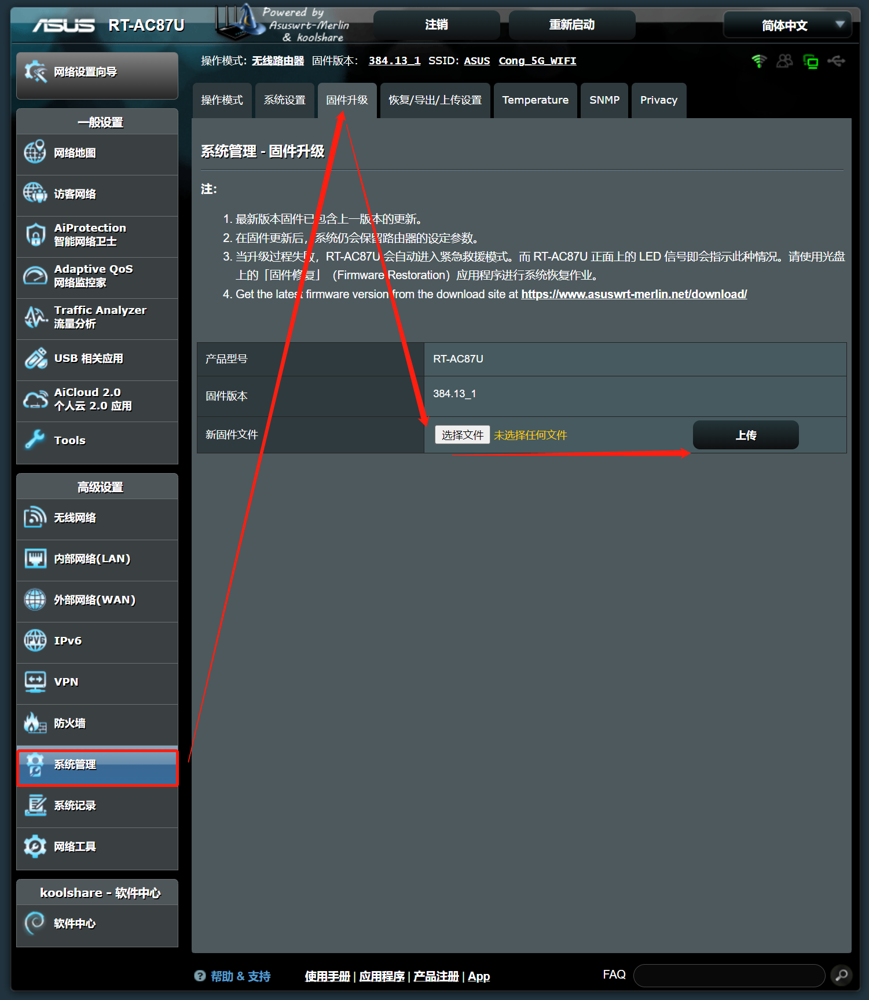
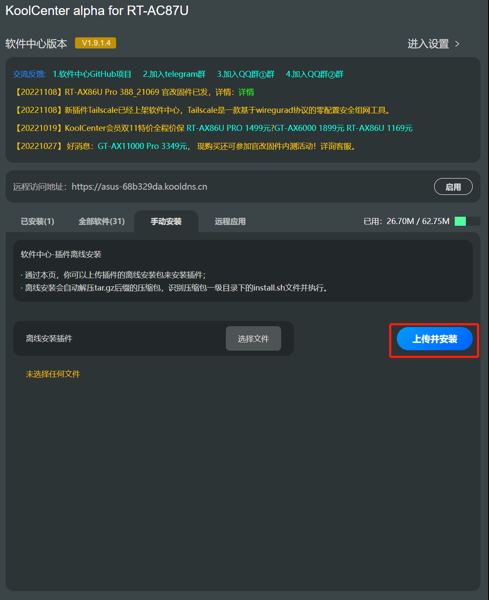
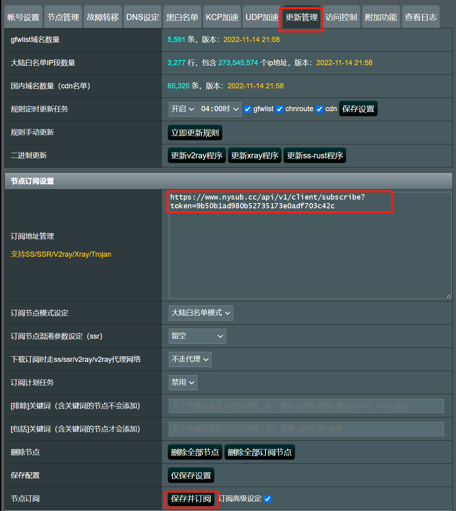
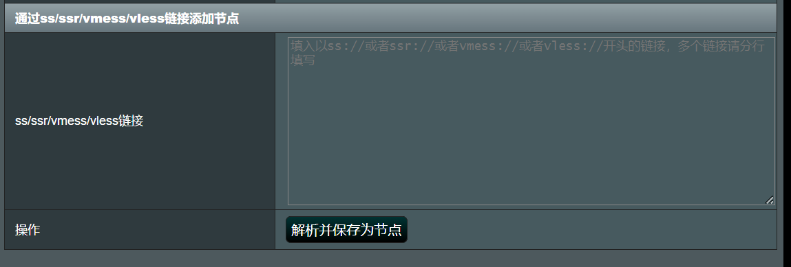

路由器固件下载地址：

[https://fw.koolcenter.com/well-known-authors/KoolCenter\_Merlin\_Legacy\_384/RT-AC87U/](https://fw.koolcenter.com/well-known-authors/KoolCenter_Merlin_Legacy_384/RT-AC87U/)

科学上网插件：

[https://github.com/hq450/fancyss/raw/3.0/packages/fancyss\_hnd\_full.tar.gz](https://github.com/hq450/fancyss/raw/3.0/packages/fancyss_hnd_full.tar.gz)

路由器更新固件：

更新Koolshare软件中心

上传插件包：

设置订阅节点：

或者通过ss/ssr/vmess/vless链接添加节点

